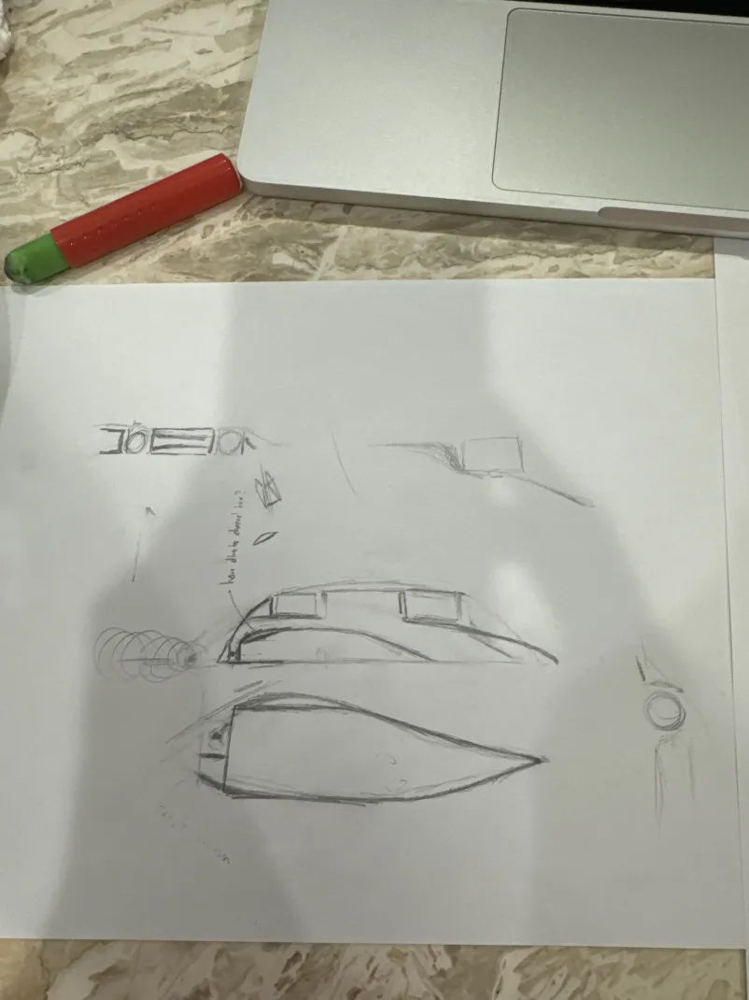
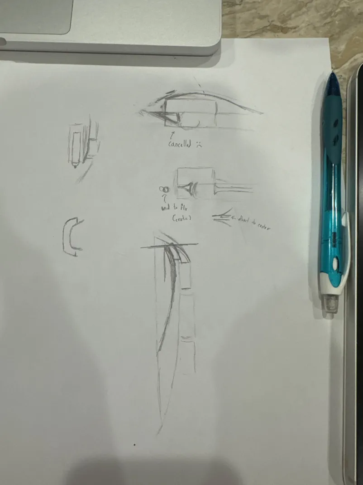

# Anduril Design

Car designs, CAD exports, and supporting models for team ANDÚRIL RACING from Marlborough College Malaysia.


*Pencil sketch of the final car.*

### Original sketches

| Initial concepts | Further design ideas |
| --- | --- |
|  |  |

*Early sketches of the body shape and possible airflow paths.*

Full-size scanned drawings:

- [Design sheet 1](<design/car/v3/F1S V3 - 1.jpeg>).
- [Design sheet 2](<design/car/v3/F1S V3 - 2.jpeg>).

[Main project](https://github.com/Ice-Citron/anduril) · [CFD and manufacture](https://github.com/Ice-Citron/Anduril-CFD-and-Manufacturing) · [Team website](https://andurilracing.com)

## About this repository

This repository records the design work behind our F1 in Schools project. It follows the car through five versions, from early Blender models to geometry exports for manufacture and simulation.

I worked on ANDÚRIL as the team and technical lead. The wider project combined car development with a 20 m test track and a team website. This repository contains the design files from that work.

I kept the earlier versions because they show how the design developed. The folders contain sketches, alternative geometries, and intermediate exports alongside the later models.

The files also preserve contributions from other team members. Several revisions retain Louis’s name in their original filenames.

## Car development

The [car design folder](design/car/) contains versions 1–5.

| Version | Contents |
| --- | --- |
| [Version 1](design/car/v1/) | Initial Blender models and a body STL export. |
| [Version 2](design/car/v2/) | Revised Blender models, OBJ files, and component exports for CFD work. |
| [Version 3](design/car/v3/) | Hand sketches, body and wing revisions, and diffuser variants. |
| [Version 4](design/car/v4/) | Further Blender revisions, print geometry, and STEP conversions for CNC manufacture. |
| [Version 5](design/car/v5/) | Later CNC and CFD geometry exports, with STL files for resin checks. |

Start with [Version 5](design/car/v5/) for the later exports. The earlier folders show the design history.

### Version 3 alternatives

Version 3 contains geometry variants with:

- No diffuser.
- A single diffuser.
- A double diffuser.

The [diffuser export folder](<design/car/v3/Diffuser Test - STL/>) keeps these alternatives together.

The sketches record ideas about the car body and airflow. The model files show the subsequent design revisions.

### Blueprints and checks

The [blueprints folder](design/car/blueprints/) contains Blender projects and an STL file under `Fauzi Check/`.

These files sit alongside the numbered versions because the original folder grouped blueprint work and geometry checks.

## Exports for physical models

The [exports folder](exports/) groups files by their intended use.

| Folder | Contents |
| --- | --- |
| [Display models](exports/display-models/) | Car and component exports for the pit display. |
| [Resin prints](exports/resin-print/) | Front-wing and rear-wing STL files. |
| [STL files for STEP conversion](exports/stl-for-step-conversion/) | Component meshes collected for conversion work. |

Version-specific exports remain with their design versions. This preserves the connection between each model and its associated files.

Selected later exports include:

- [Version 5 CNC geometry](<design/car/v5/Export Variant/Version 5 - CNC v3.step>).
- [Version 5 CFD geometry](<design/car/v5/CFD Variant/STEP - UoSM/>).
- [Version 5 resin-check geometry](<design/car/v5/Resin Check - Front Wing + Rear Wing/>).

## Track and pit display

The project extended beyond the car itself.

- [Track design](design/track/) contains the Blender project for the track.
- [Pit-display design](design/pit-display/) contains the Blender project for the display.

The [main repository](https://github.com/Ice-Citron/anduril) contains photographs of the practical work and the wider team project.

## CFD presentation

The [documents folder](docs/cfd/) contains the CFD presentation and the final-car pencil sketch shown at the top of this page.

The [presentation](docs/cfd/F1_mcm.pptx) compares single and double rear vanes in COMSOL 6.1. It includes:

- Model assumptions.
- Mesh illustrations.
- Boundary conditions.
- Drag results over time.
- Flow and pressure visualisations.

The presentation reports slightly lower drag for the single-vane model in that comparison. It also identifies a coarse mesh and simplified flow assumptions as limitations.

The [CFD and manufacturing repository](https://github.com/Ice-Citron/Anduril-CFD-and-Manufacturing) contains the companion simulation and geometry-preparation files.

## Reference materials

The [reference-assets folder](reference-assets/) contains standard component geometry and decals. These assets provided reference geometry alongside our own designs.

The [regulations folder](docs/regulations/) contains the Malaysian State Finals documents from 2024:

- [Competition regulations](docs/regulations/f1_in_schools_Malaysia_competition_regulations_2024_state_finals.pdf).
- [Technical regulations](docs/regulations/f1_in_schools_Malaysia_technical_regulations_2024_state_finals.pdf).
- [View the competition decals](reference-assets/Decal/).

## File formats

| Format | Purpose |
| --- | --- |
| `.blend` | Blender project files. |
| `.blend1` | Blender backup files retained with the projects. |
| `.stl` | Surface-mesh exports. |
| `.step`, `.stp` | CAD geometry exchange. |
| `.obj`, `.mtl` | Mesh geometry and associated material definitions. |
| `.igs`, `.ipt` | Reference component geometry and Inventor part files. |
| `.pptx`, `.pdf` | Presentations and reference documents. |

Open the Blender projects in Blender. Use a compatible CAD application for the geometry exports.

Keep companion files together. For example, the Version 2 OBJ file refers to its adjacent MTL file.

## Repository structure

```text
Anduril-Design/
├── README.md
├── LICENSE
├── .gitignore
├── design/
│   ├── car/
│   │   ├── v1/
│   │   ├── v2/
│   │   ├── v3/
│   │   ├── v4/
│   │   ├── v5/
│   │   └── blueprints/
│   ├── track/
│   └── pit-display/
├── exports/
│   ├── display-models/
│   ├── resin-print/
│   └── stl-for-step-conversion/
├── reference-assets/
└── docs/
    ├── regulations/
    └── cfd/
```

The internal filenames retain the original version labels and contributor references.

## Project walkthrough

I recorded an earlier project walkthrough for Hack Club.

[Watch the walkthrough on YouTube](https://www.youtube.com/watch?v=mP4dqV3jQZ4).

## Related repositories

- [ANDÚRIL main project](https://github.com/Ice-Citron/anduril) — team website, photographs, and sponsorship materials.
- [Anduril CFD and Manufacturing](https://github.com/Ice-Citron/Anduril-CFD-and-Manufacturing) — simulation studies, mesh preparation, and manufacturing geometry.

## Licence

See [LICENSE](LICENSE) for the Apache License 2.0.
